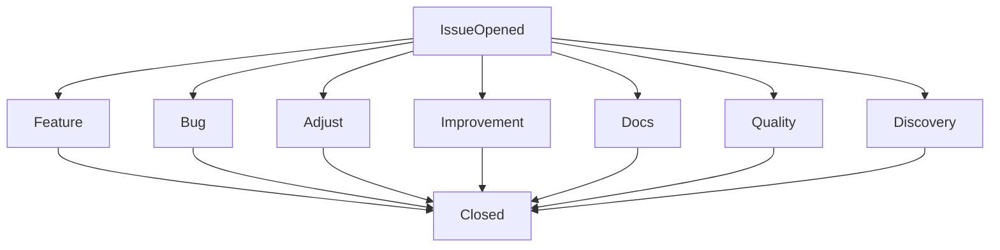
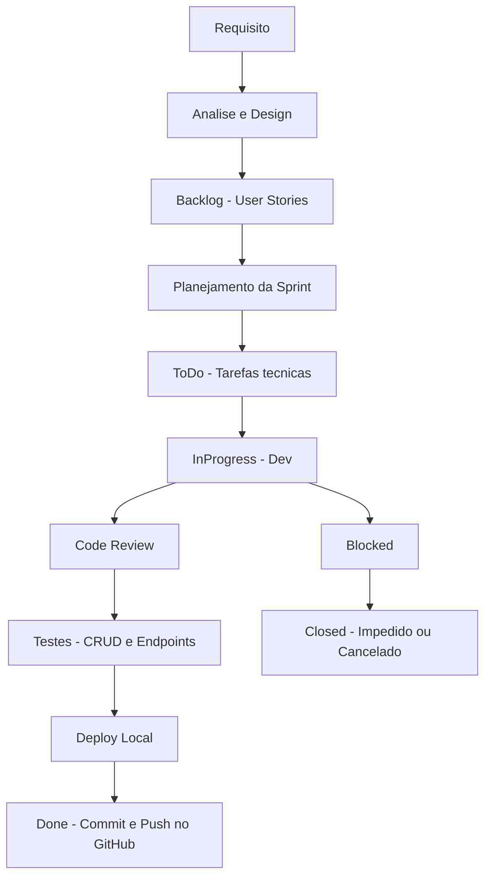

# Fluxo de Desenvolvimento
A equipe conduz o desenvolvimento por meio de um fluxo estruturado com base em métodos ágeis, como Kanban e Scrum, passando por etapas claras desde a identificação do problema até a entrega da funcionalidade.
# Issues

Cada tipo de issue define o tipo de implementação a ser feita no código

- **Feature**: Novas funcionalidades, normalmente algo que ainda não existe na aplicação
- **Bug**: Problema a ser resolvido, que muito provavelmente impossibilita e/ou atrapalha a execução de alguma ação
- **Adjust**: Pequenas modificações que não chegam a ser nova funcionalidade, por exemplo, alterar a cor de algo
- **Improvement**: Melhoria significativa em alguma funcionalidade já existente, por exemplo, melhorar uma validação de um formulário
- **Quality**: Tarefas que envolvem a qualidade do código, normalmente algumra refatoração
- **Discovery**: Dificilmente envolvem código, mas sim, levantamento de informações sobre alguma biblioteca e/ou abordagem técnica a ser utilizada, por exemplo, uso da autenticação com GovBr
- **Docs**: Tarefas que envolvem criação e/ou melhoria exclusivamente da documentação, como a criação deste fluxo
# 
# Sprints
### Tarefas (Issues/Tasks)
A equipe se organiza de forma autogerenciável, aplicando boas práticas de SCRUM e desenvolvimento ágil, selecionando, conforme habilidades e disponibilidade, as issues que fazem sentido para o objetivo da sprint e que são viáveis de serem implementadas nesse ciclo.

## Explicação

- **Requisito**: ponto de partida, vindo do enunciado do trabalho.  
- **Analise e Design**: definição de entidades, relacionamentos, telas e padrões usados.  
- **Backlog / Planejamento / ToDo**: organização das tarefas que serão feitas na sprint.  
- **InProgress**: momento em que o desenvolvimento do código está acontecendo.  
- **Code Review**: revisão do código e das regras implementadas.  
- **Testes**: validação dos CRUDs, endpoints extras e comportamento geral.  
- **Deploy Local**: execução do sistema via `php artisan serve` e testes finais.  
- **Done**: commit e push no GitHub, pronto para entrega.  
- **Blocked / Closed**: tarefas que ficaram impedidas ou foram canceladas.
